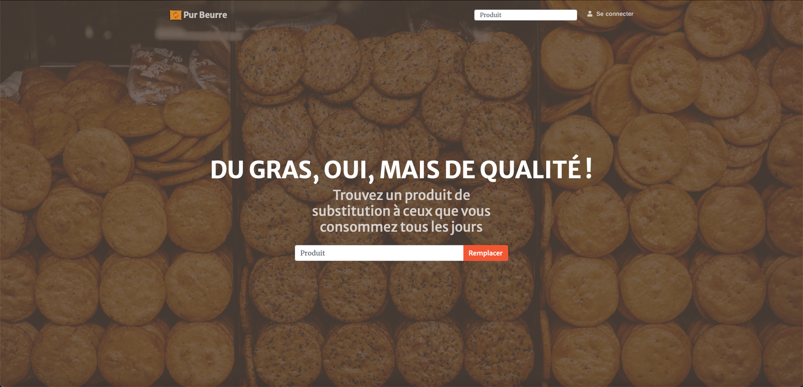

# P8

## Qu'est-ce que c'est ?

     

P8 est une plateforme web pour amateurs de Nutella créé dans le cadre du parcours développeur d'application Python d'OpenClassrooms. Cette application permet notamment : 
- Le remplacement d'un aliment : entrez le nom de l'aliment dans le champ de recherche de la page d'acceuil, le site vous donnera un aliment de la même catégorie plus sain
- La consultation de fiches produit : informez-vous sur la nutrition des aliments de votre choix
- La conservation de ces fiches dans un espace perso : enregistrez les substituts sains trouvés au fil de vos recherches

Les données alimentaires indispensables au bon fonctionnement de site sont gracieusement fournies par [OpenFoodFacts](https://fr.openfoodfacts.org).

## Langages, modules et API

### Partie client:
- HTML5 
- Bootstrap 4  avec le thème Bootstrap [Creative](https://startbootstrap.com/themes/creative/)
- Vanilla JavaScript 

### Partie serveur:
- Python 3.6 
- Web framework Django 
- Base de données PostgreSQL 
- et d'autres modules python à voir dans le pipfile ou requirements.txt (requests...)

### API : 
- **OpenFoodFacts** pour remplir la base de données de donées alimentaires

## Comment ça s'installe ?

**Aucune installation est nécessaire**, l'app est accessible à l'adresse : https://pur8eurre.herokuapp.com

